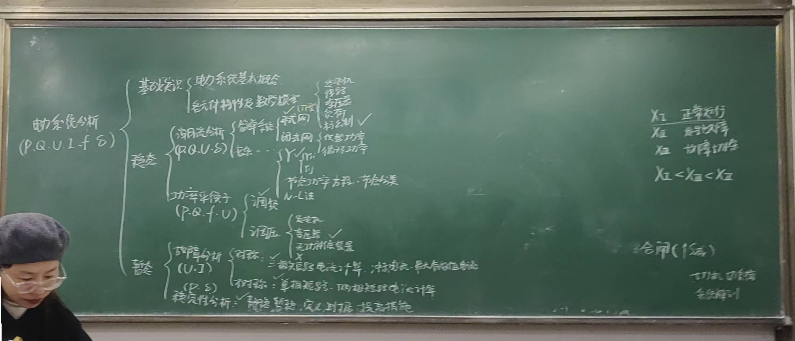

## 电力系统分析

- 电力系统分析
  - 基础知识
    - 电力系统基本概念
    - 各原件特性及数学模型
      - 发电机
      - 输电线路
      - 变压器
      - 负荷
      - 标幺制(#core)
  - 稳态
    - 潮流分析(P Q U \delta )
      - 简单系统的潮流分析
        - 开式网(#core 大题)
        - 闭式网(不考)
          - 供载功率
          - 循环功率
      - 复杂系统的潮流分析
        - 节点导纳矩阵(#CORE 烤)
          - YII,YIJ
        - 节点功率方程，节点分类
        - N-R法(不考)
    - 功率平衡
      - 调频(# CORE 烤，课堂例题和课后作业)
      - 调压
        - 发电机
        - 变压器(# CORE 烤)
        - 并联无功补偿装置
        - X（串电容）
  - 暂态
    - 故障分析
      - 对称性
        - 三相短路电流计算(# core 冲击电流和最大有效值电流)
      - 不对称
        - 单相短路，两项短路电流计算(#CORE)
    - 稳定性分析（$P,\delta$）(# core)
      - 静态
      - 暂态(定义，判据，提高措施)

## 图

