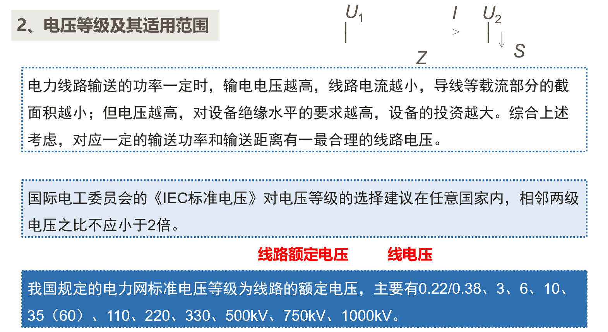

<!--
 * @Author: Ashington ashington258@proton.me
 * @Date: 2024-09-10 08:10:35
 * @LastEditors: Ashington ashington258@proton.me
 * @LastEditTime: 2024-09-10 08:10:38
 * @FilePath: \Power_system_analysis\1-电力系统的基本概念\1-电力系统的基本概念.md
 * @Description: 请填写简介
 * 联系方式:921488837@qq.com
 * Copyright (c) 2024 by ${git_name_email}, All Rights Reserved. 
-->

**主要查看PPT中写的笔记**