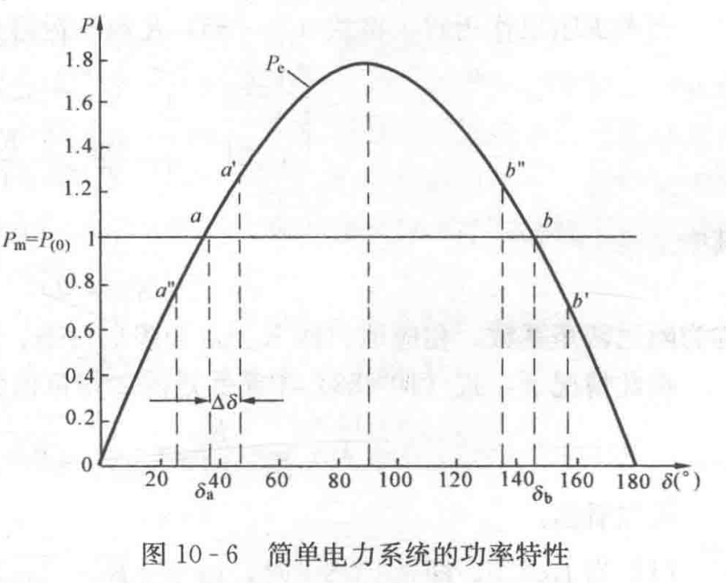
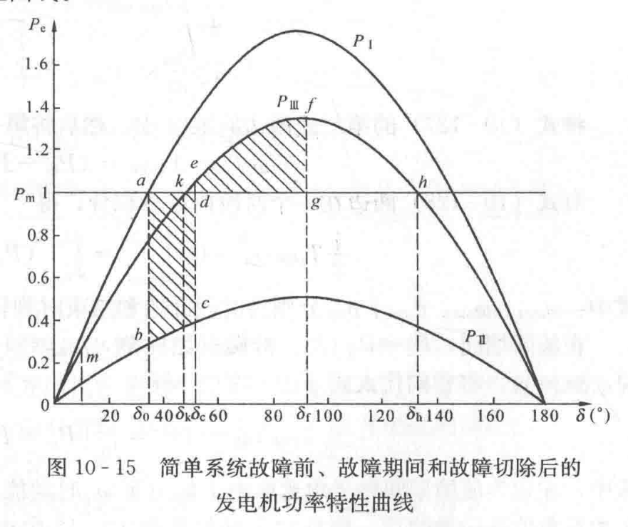
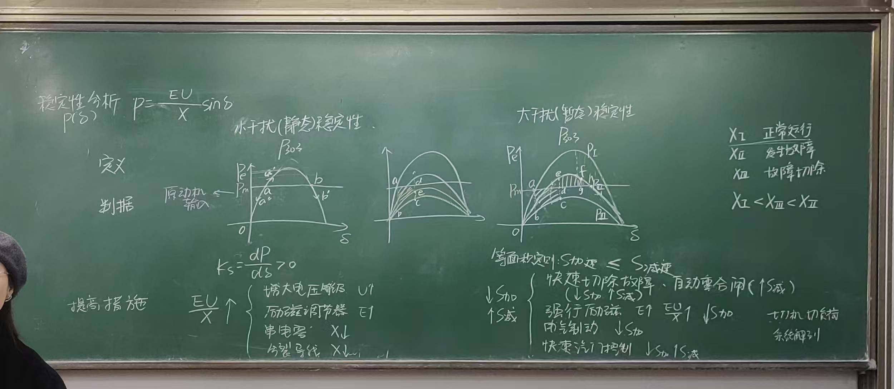

# 电力系统稳定性分析

- 稳定性分析
  - $P(\delta) = \frac{EU}{X}\sin(\delta)$
- 小干扰(静态)稳定性
- 大干扰(暂态)稳定性

## 功角稳定性

|          | 小干扰(静态)稳定性                                                                                                                                                                                                                                                                                                                 | 大干扰(暂态)稳定性                                                                                                                                                                                                    |
| -------- | ---------------------------------------------------------------------------------------------------------------------------------------------------------------------------------------------------------------------------------------------------------------------------------------------------------------------------------- | --------------------------------------------------------------------------------------------------------------------------------------------------------------------------------------------------------------------- |
| 定义     | **小于扰稳定性**。电力系统的小于扰稳定性（以前称为静态稳定性）实质上是要求系统的给定平衡点（即给定的稳定运行方式）遭受微小扰动后能够保持渐近稳定。由于负荷情况和系统接线情况的不同，系统的稳定运行方式也各不相同，因此，实际上要求系统在各种可能的稳定运行情形下都能够满足小于扰稳定性。而且，还要求系统具有一定的小于扰稳定裕度。 | **大于扰稳定性**（暂态稳定性）。在电力系统中，大于扰稳定性习惯上称为暂态稳定性。在我国所制订的《电力系统安全稳定导则》中，定义：“暂态稳定性是指电力系统受到大于扰后，各同步发电机保持同步运行并过渡到新的稳态的能力。 |
| 判据     |                                                                                                                                                                                                                                                                                                                  |                                                                                                                                                                                                   |
| 判据公式 | $$K_s = \frac{dP}{d\delta} > 0$$                                                                                                                                                                                                                                                                                                   | 面积等效原理$$S_{加速}<=S_{减速}$$                                                                                                                                                                                    |

