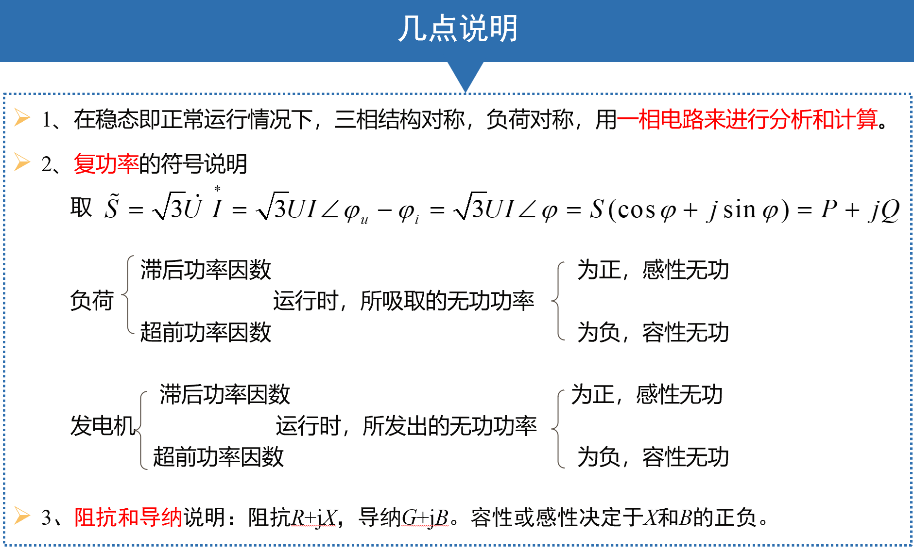
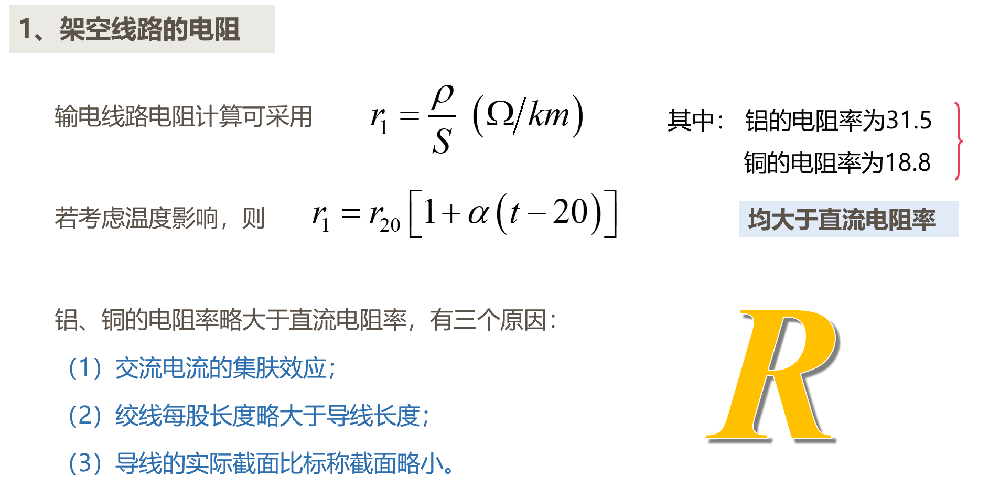
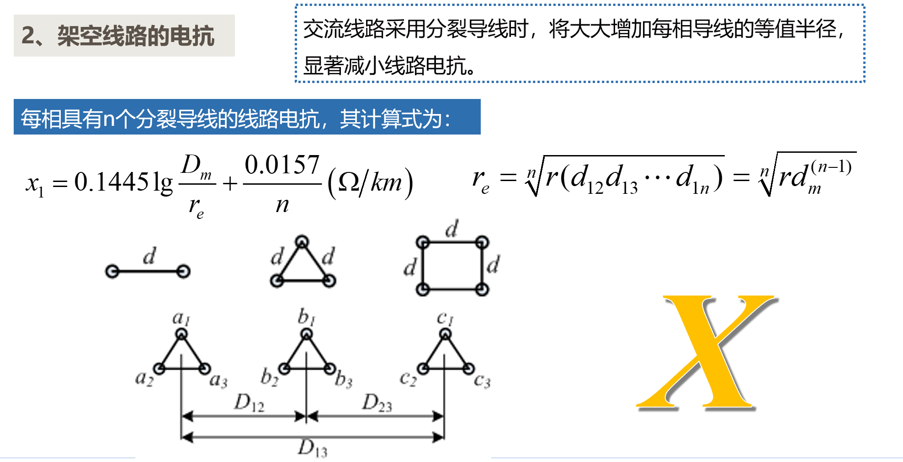
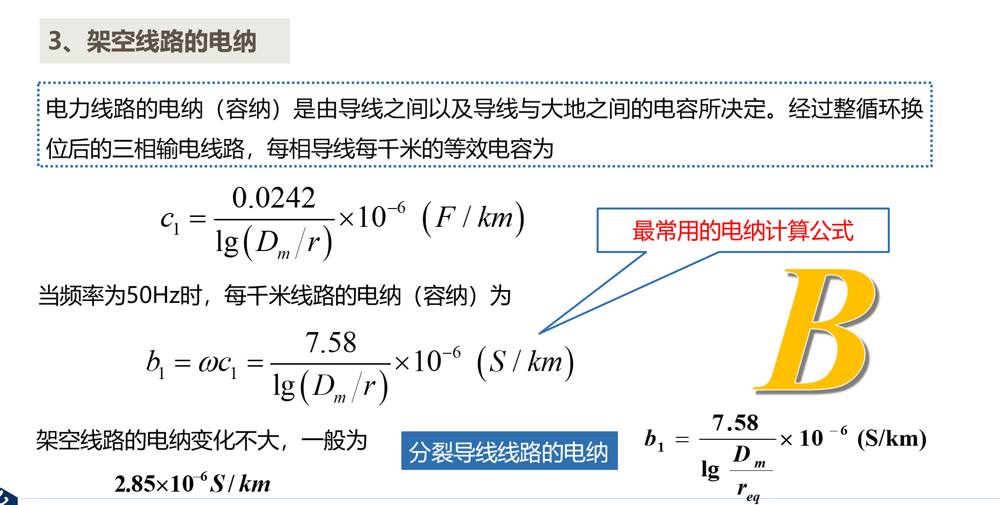
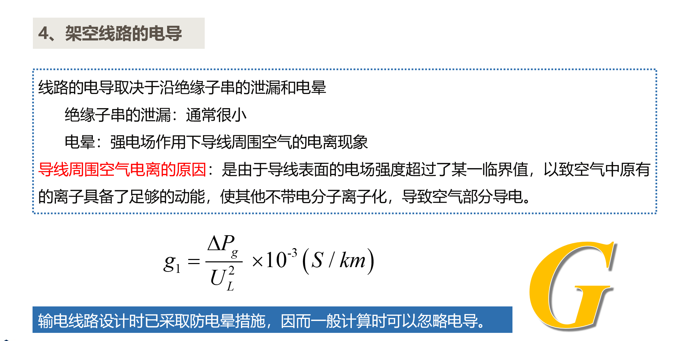
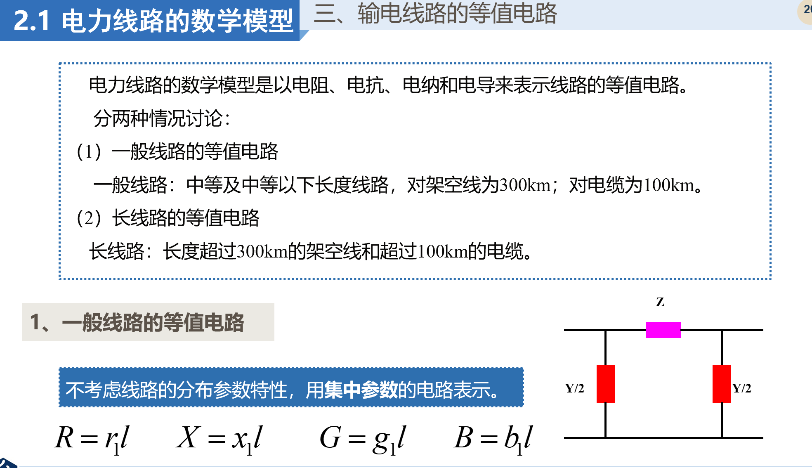
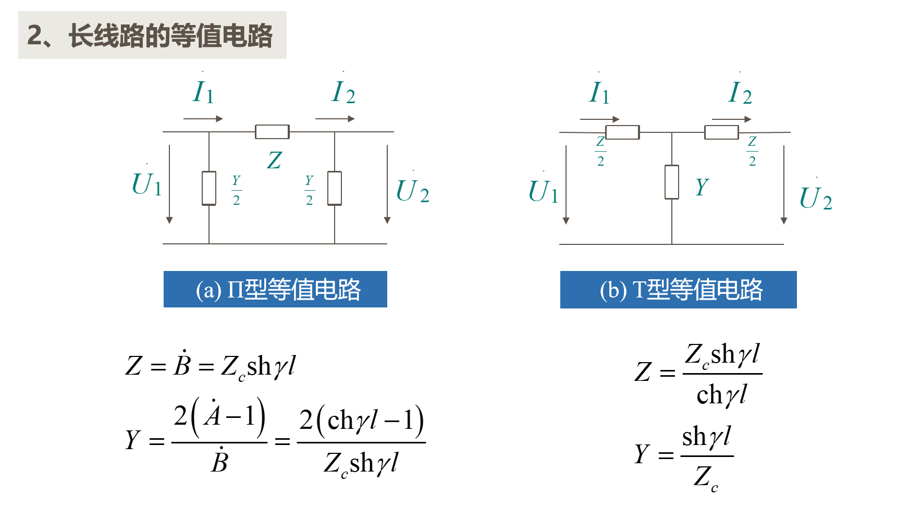
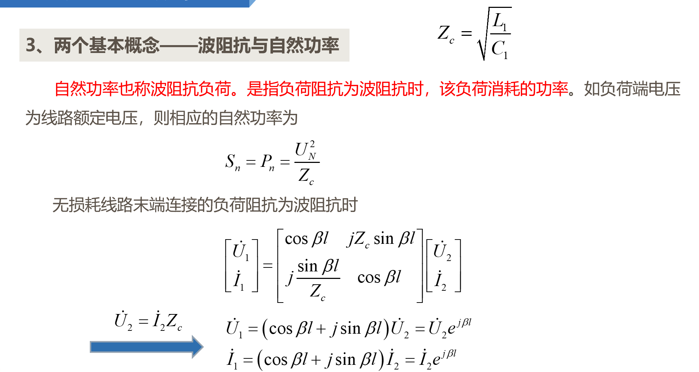
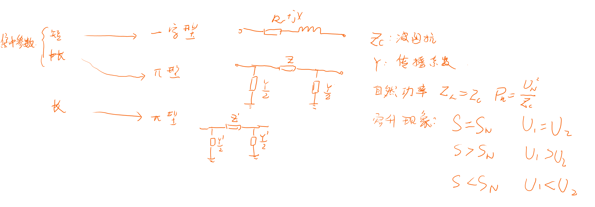

<!--
 * @Author: Ashington ashington258@proton.me
 * @Date: 2024-09-10 09:22:50
 * @LastEditors: Ashington ashington258@proton.me
 * @LastEditTime: 2024-09-20 16:01:52
 * @FilePath: \Power_system_analysis\2-正序参数和等值电路\1-正序参数和等值电路.md
 * @Description: 请填写简介
 * 联系方式:921488837@qq.com
 * Copyright (c) 2024 by ${git_name_email}, All Rights Reserved.
-->

# 正序参数和等值电路

- [正序参数和等值电路](#正序参数和等值电路)
  - [1 电力线路的数学模型](#1-电力线路的数学模型)
    - [1.1 电气参数](#11-电气参数)
    - [1.2 等效电路](#12-等效电路)
    - [1.3 自然功率](#13-自然功率)
  - [2 总结](#2-总结)

## 1 电力线路的数学模型

### 1.1 电气参数

- **电气参数**
  - **电阻 R**：热效应$r\propto\frac{\rho}{s} $
  - **电抗 X**：磁效应$x\propto\frac{D_m}{r_e}$
  - **电导 G**：电晕，泄露电流$\approx$0 ,$b\propto\frac{r_e}{D_m}$
  - **电纳 B**：电场效应$$

### 1.2 等效电路

|          | 架空线    | 电缆   |
| -------- | --------- | ------ |
| 短线路   | <100km    | <10km  |
| 中长线路 | 100~300km | <100km |
| 长线路   | >300km    | >100km |

- 短线路（一字型）
- 中长线路（）
- 长线路（）

### 1.3 自然功率

当阻抗等于波阻抗的时候

容升现象
==**IMPORTANCE**==

## 2 总结

