<!--
 * @Author: Ashington ashington258@proton.me
 * @Date: 2024-09-13 17:12:41
 * @LastEditors: Ashington ashington258@proton.me
 * @LastEditTime: 2024-09-20 17:28:28
 * @FilePath: \Power_system_analysis\2-正序参数和等值电路\2-变压器的数学模型.md
 * @Descri           ption: 请填写简介
 * 联系方式:921488837@qq.com
 * Copyright (c) 2024 by ${git_name_email}, All Rights Reserved. 
-->

# 变压器的数学模型

- [变压器的数学模型](#变压器的数学模型)
  - [1 双绕组](#1-双绕组)
  - [2 三绕组](#2-三绕组)
  - [3 自耦变压器](#3-自耦变压器)
  - [4 总结](#4-总结)
  - [4 发电机](#4-发电机)

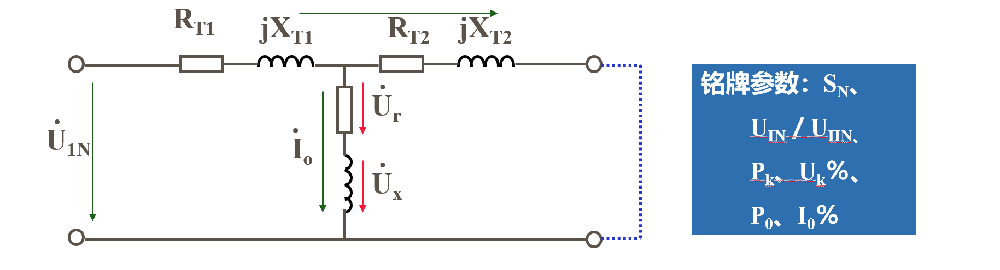
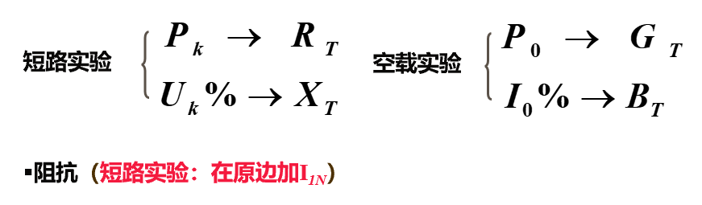

**目的就是根据铭牌参数计算虚拟参数(等效电路的各项参数)**

**三项变压器可以三角形或者星形，但是本课程一致认为是星形电路(Y型)$I_{相}=I_{线}$**

## 1 双绕组
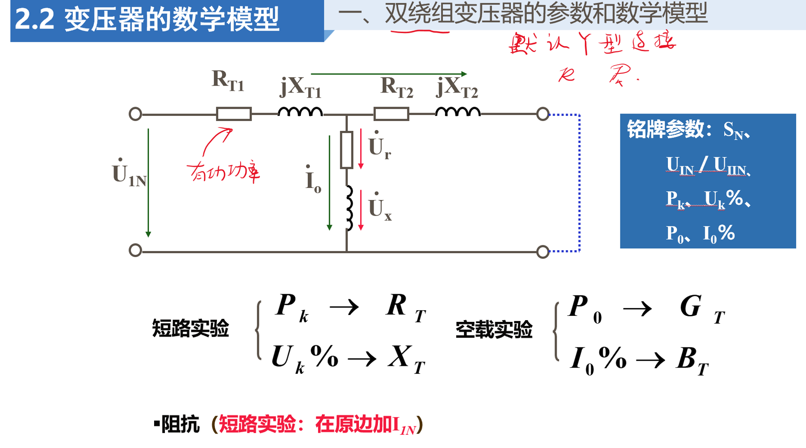
**双绕组变压器的四个参数**
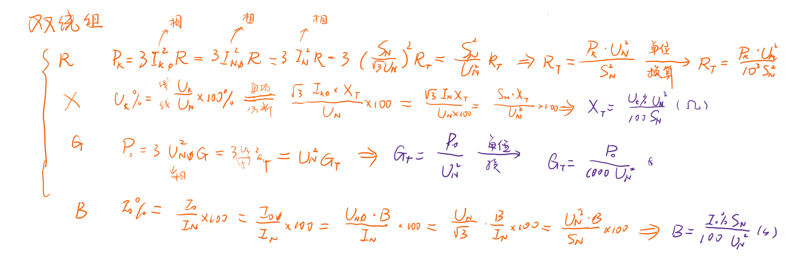

## 2 三绕组
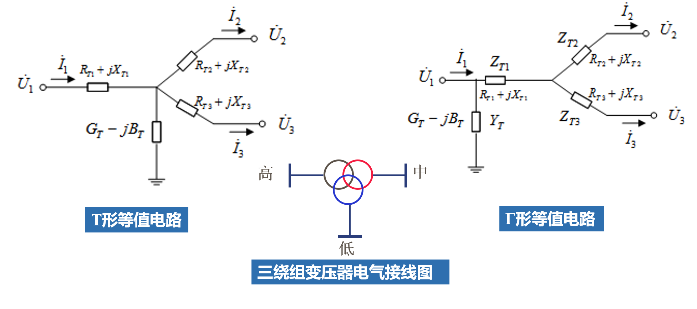

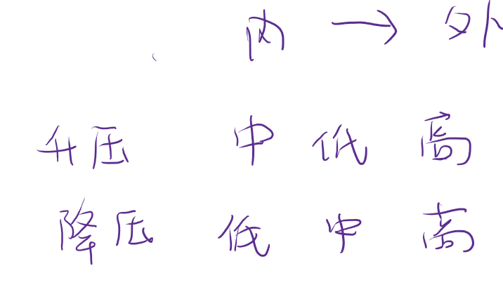

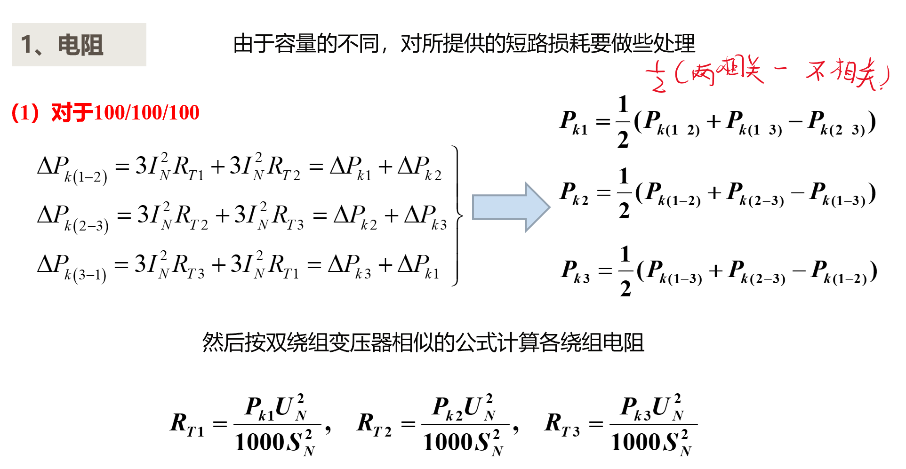

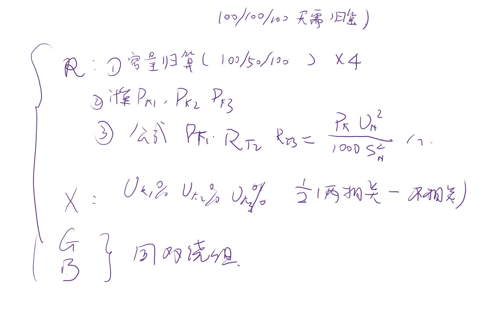

## 3 自耦变压器

## 4 总结

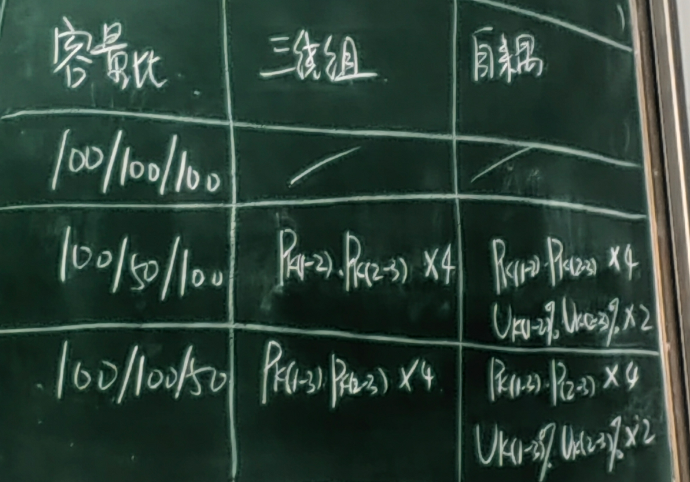

| 容量值      | 三绕组 | 自耦 |
| ----------- | ------ | ---- |
| 100/100/100 |        |      |
|             |        |      |

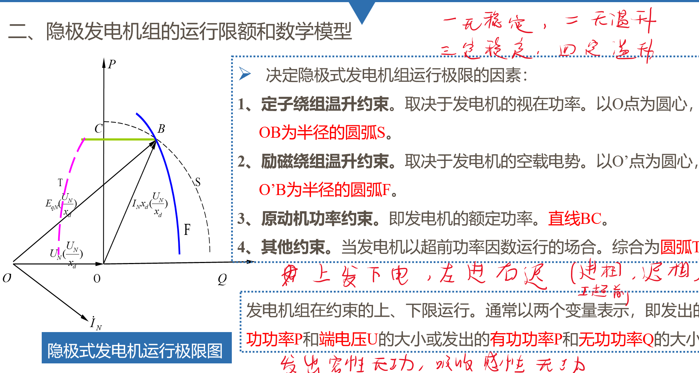

## 4 发电机

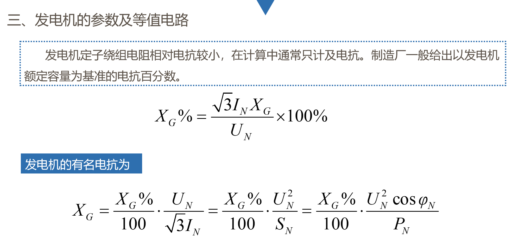