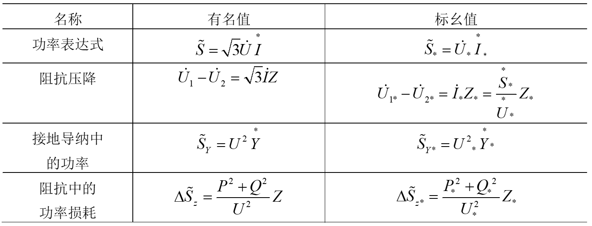

# 标幺制和电网等值电路

- [标幺制和电网等值电路](#标幺制和电网等值电路)
  - [1 标幺值](#1-标幺值)
  - [2 带变比的变压器等值电路](#2-带变比的变压器等值电路)

|  |  |
| ------------------------- | ------------------------- |

## 1 标幺值

1. 标幺值的定义
   
   标幺值取决与基准值，所以基准值的选择非常重要

2. 基准值的选取

   1. $S_B=\sqrt{3}U_BI_B$
   2. $U_B = \sqrt{3}I_BZ_B$
   3. 其他的可以根据$U_B$$S_B$计算出来$Y_B = \frac{1}{Z_B}$
   4. 

3. 基准值改变时的标幺值换算
   
   

**！ 基准不同的标幺值不能直接计算，需要统一基准 ！**

例如转换成有名值，先有名话，再标准

告诉的标幺值是自己的额定值 Z_N 计算不可以使用，需要先计算有名值，再标幺化

- **基准值的选择**
  - P ,Q ,S $\rightarrow$ $S_B$
  - U $\rightarrow$ $U_B$
  - R, X ,Z $\rightarrow$ $Z_B$
  - G, B ,Y $\rightarrow$ $Y_B$

1. 总结表
   

## 2 带变比的变压器等值电路

- 两个概念
  1. 近似计算法
  2. 平均额定电压
  3. $Z^*_{new} = Z^*_{old} \frac{S_{B}}{S_{N}}$

