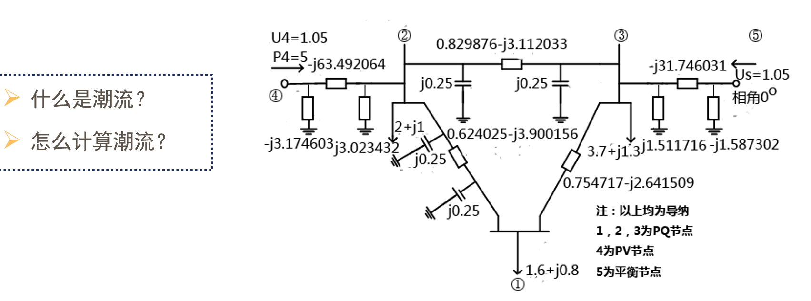
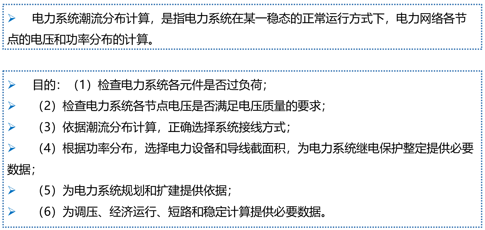
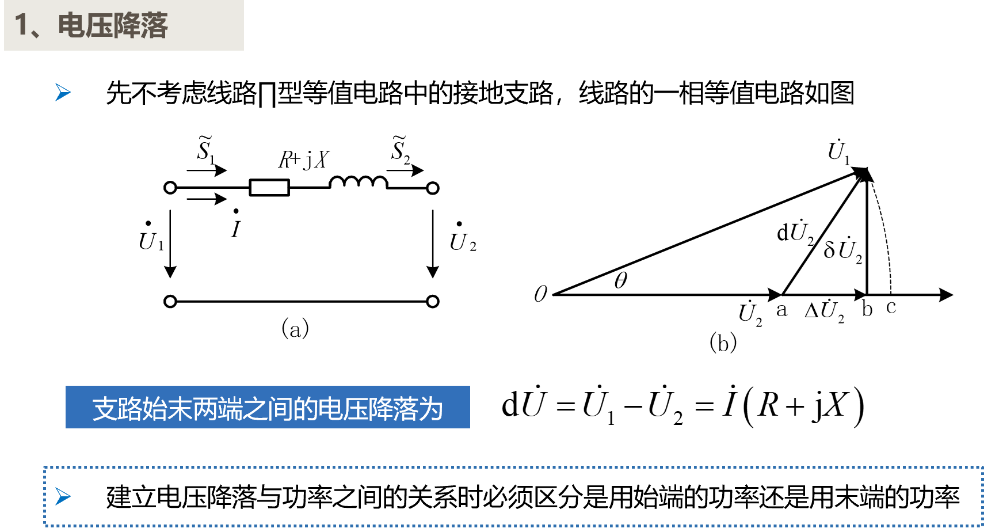
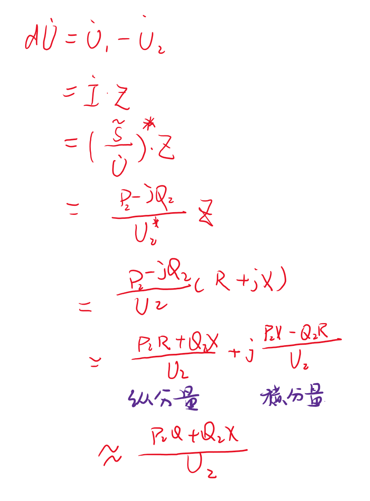
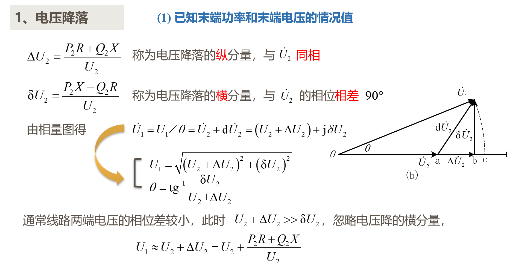

# 概述

## 2 功率损耗和电压降落

**需要将电压电流方程转化成电压功率方程**

### 2.1 电压降落

电压降落是向量差，满足三角形运算法则。

- 复功率
    $$\tilde{S}=\dot{U}\cdot\dot{I}^{*}=P+jQ$$

- 三种表示形式
  $$u=U_{m}\sin(wt+\varphi)\\U_{m}\angle\psi=U_{m}e^{j\varphi}\\U_{m}\cos\varphi+jU_{m}\sin\varphi $$
- 电压降落公式推导
    
    

