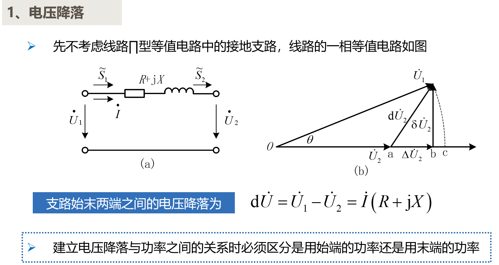
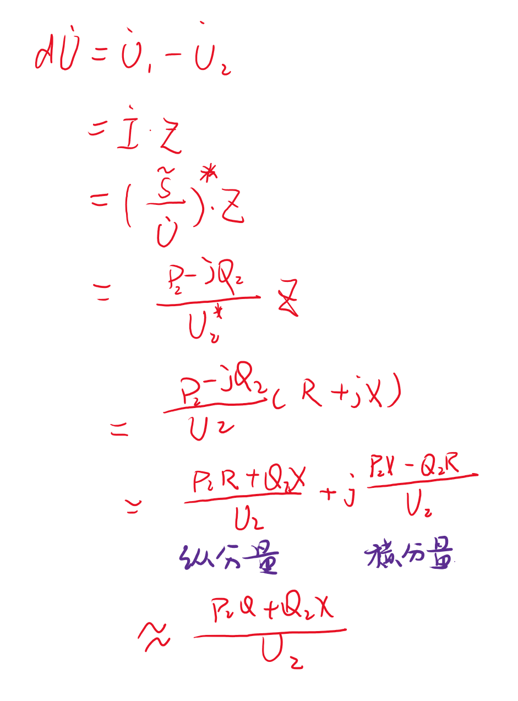

# 功率损耗和电压降落
- [功率损耗和电压降落](#功率损耗和电压降落)
  - [1 基础概念](#1-基础概念)
    - [1.1 电压降落](#11-电压降落)
    - [1.2 功率损耗和电压偏移](#12-功率损耗和电压偏移)
  - [2 线路的功率分布和功率损耗](#2-线路的功率分布和功率损耗)
    - [2.1 己知线路末端功率和末端电压的情况](#21-己知线路末端功率和末端电压的情况)
    - [2.2 己知线路始端功率和始端电压的情况](#22-己知线路始端功率和始端电压的情况)

## 1 基础概念

### 1.1 电压降落

电压降落是向量差，满足三角形运算法则。

- 复功率
    $$\tilde{S}=\dot{U}\cdot\dot{I}^{*}=P+jQ$$

- 三种表示形式
  $$u=U_{m}\sin(wt+\varphi)\\U_{m}\angle\psi=U_{m}e^{j\varphi}\\U_{m}\cos\varphi+jU_{m}\sin\varphi $$
- 电压降落公式推导
    
### 1.2 功率损耗和电压偏移

## 2 线路的功率分布和功率损耗

### 2.1 己知线路末端功率和末端电压的情况

### 2.2 己知线路始端功率和始端电压的情况

