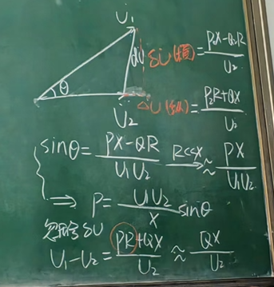

# 输电线路的运行特性

## 1 容升现象(空载运行特性)

由于**对地电容**的存在,导致末端电压升高.
**长输电线路的，长距离高压输电线空载会轻载的时候，会有容升现象。**

## 2 极限传输功率
$$P = \frac{U_1U_2}{X}\sin\theta$$

$$P_{max} = \frac{U_1U_2}{X}$$

**整个线路程感性，所以串联电容可以增加有功功率**
或分裂导线(较小阻抗)

## 3 功率与电压的特性关系

**有功功率 从超前的传到滞后的**

$$P = \frac{U_1U_2}{X}\sin\theta$$

$$Q =  \frac{(U_1 - U_2)U_2}{X}$$

**无功功率 电压从高的往电压低的去**

https://www.doc88.com/p-2734481744668.html