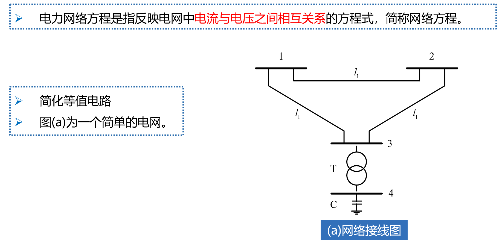
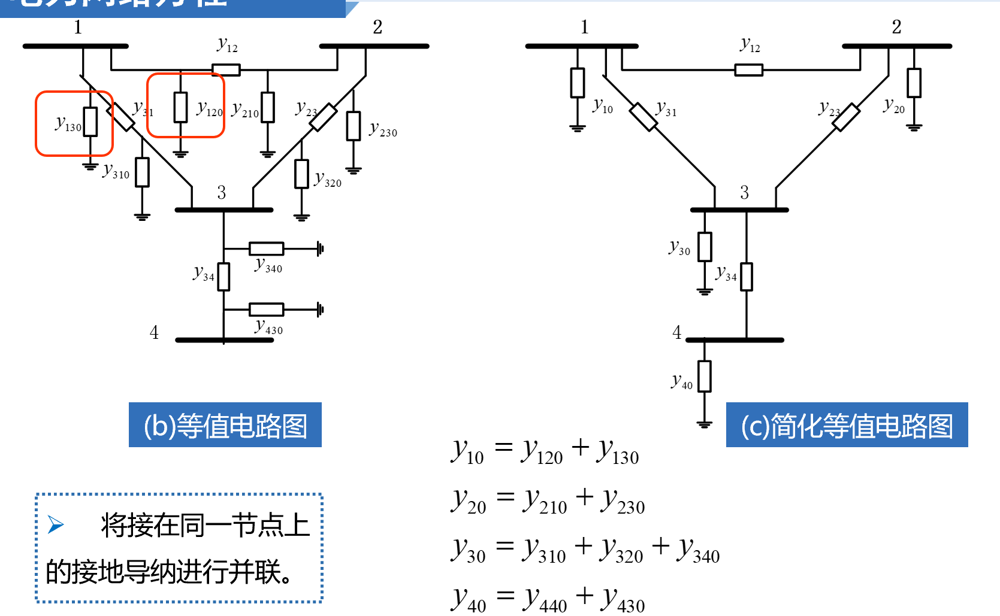
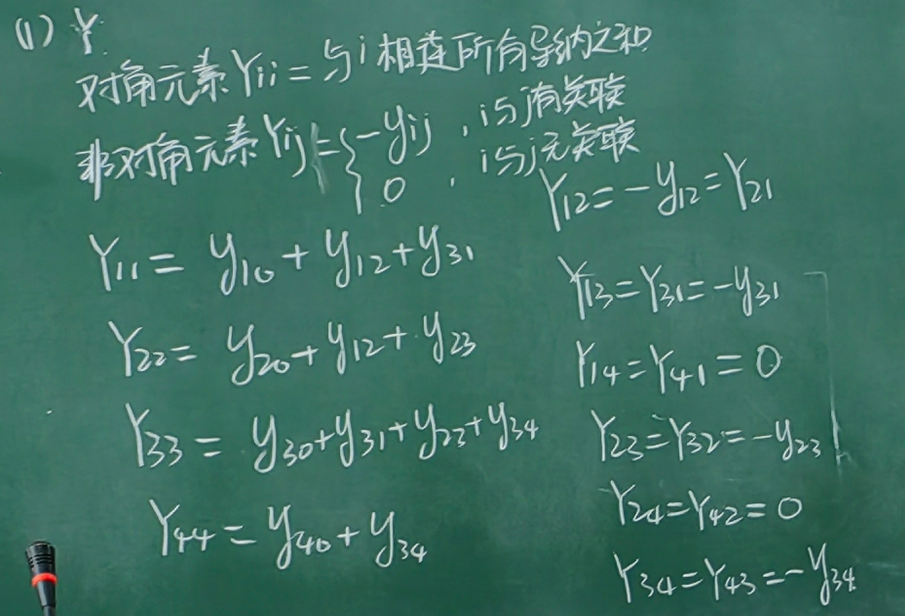
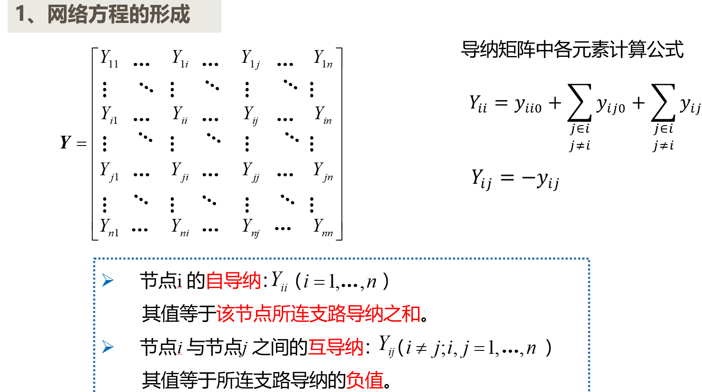
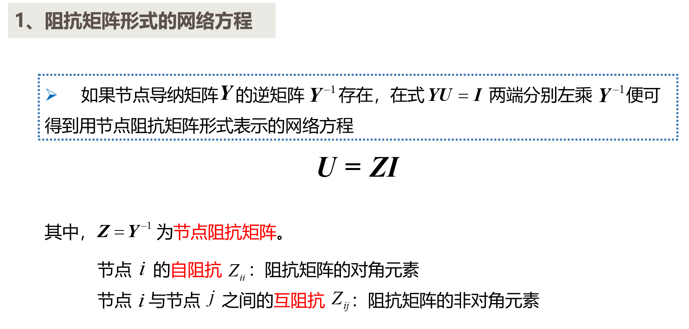

# 电力网络方程

由于支路过多，所以一般采用*节点电压法*

$$YU=I$$

由于我们关心电压和功率所以方程转化成**节点功率方程**

## 1 导纳形式
### 1.1 网络形成

### 1.2 节点导纳的特点

1. 复数：包含电导和电纳
2. 对称：元素对称
3. 稀疏：很多节点没有关系，电力网络的拓扑结构决定了稀疏性

## 2 阻抗形式
### 2.1 网络的形成

