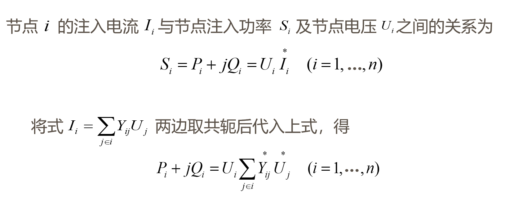
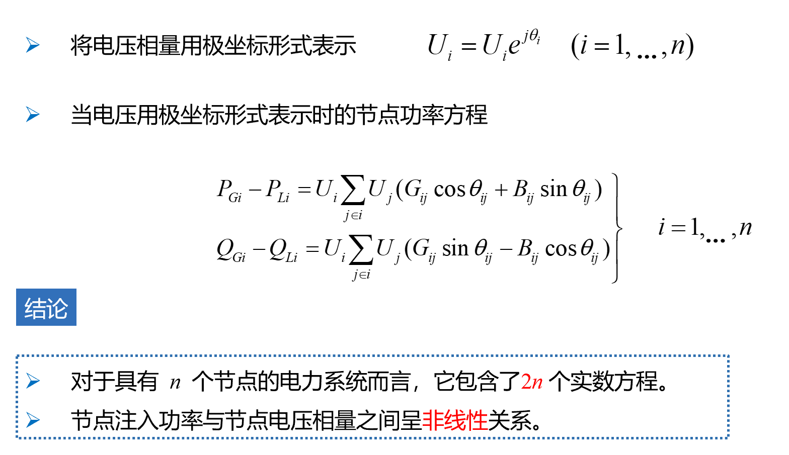
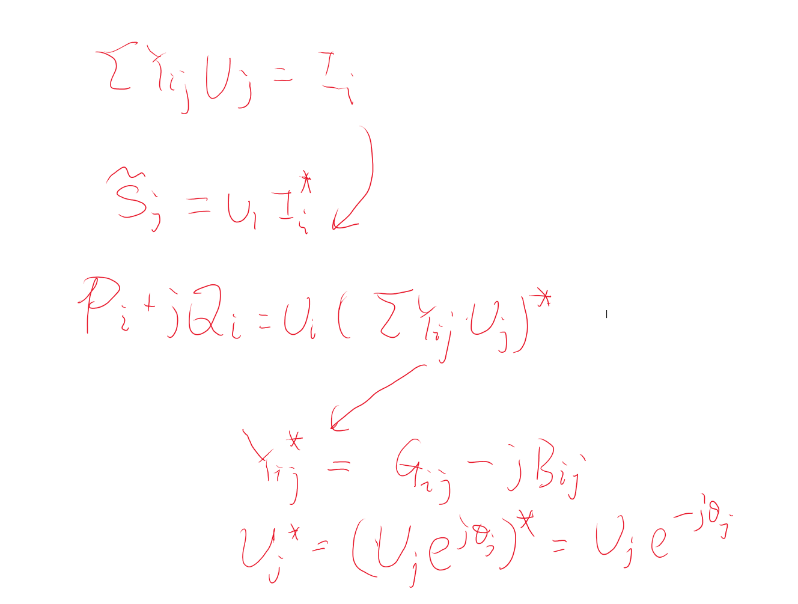
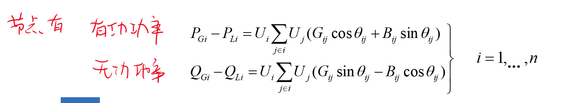
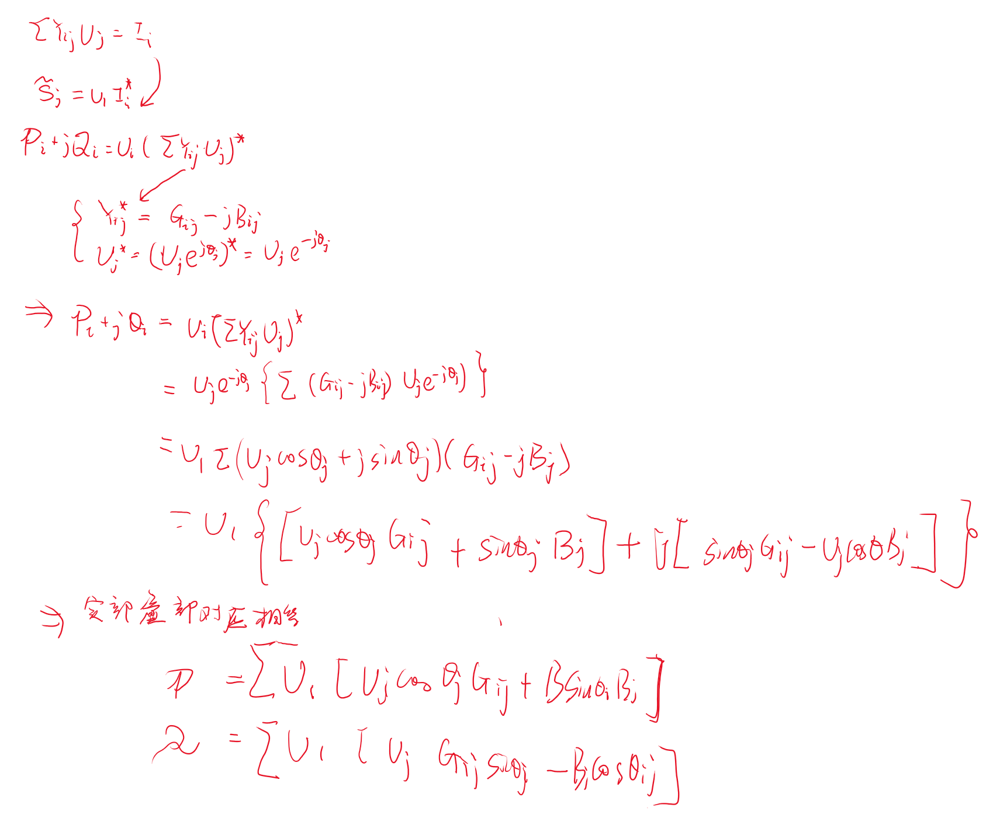
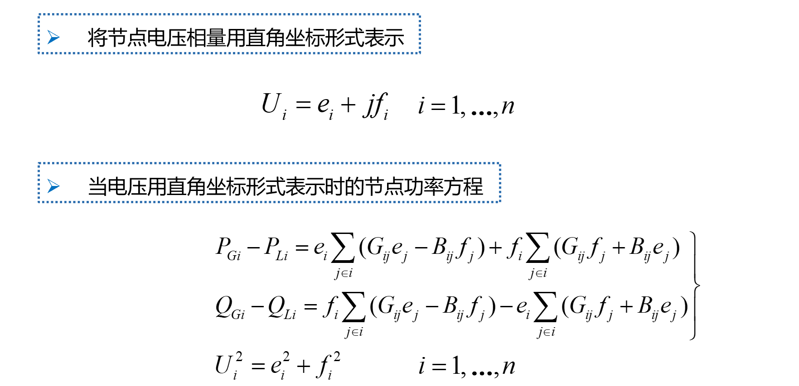

# 节点功率方程

## 1 极坐标形式

## 2 节点类型

1. PQ
2. PV
3. VQ

| 节点类型          | 待求量      | 特点       | 数量  |
| ----------------- | ----------- | ---------- | ----- |
| $PQ$              | $V, \theta$ | 最多       | m     |
| $PV$              | $Q, \theta$ | 可能有多个 | n-m-1 |
| $V\theta$平衡节点 | $P, Q$      | 只有一个   | 1     |

