# 牛顿-拉夫逊方法

将非线性方程转化成线性方程

## 1 一维非线性方程

牛顿拉夫逊法求非线性(超越函数)的根，本质是牛顿迭代求根法的一种变种，同时也是泰勒级数的一种体现，即都是使用代数函数表示超越函数的解

$f(x) = 0$

assuming that  we have an exact solution

$x^* = x^{(k)} + \Delta x$

$x^*$ is the s

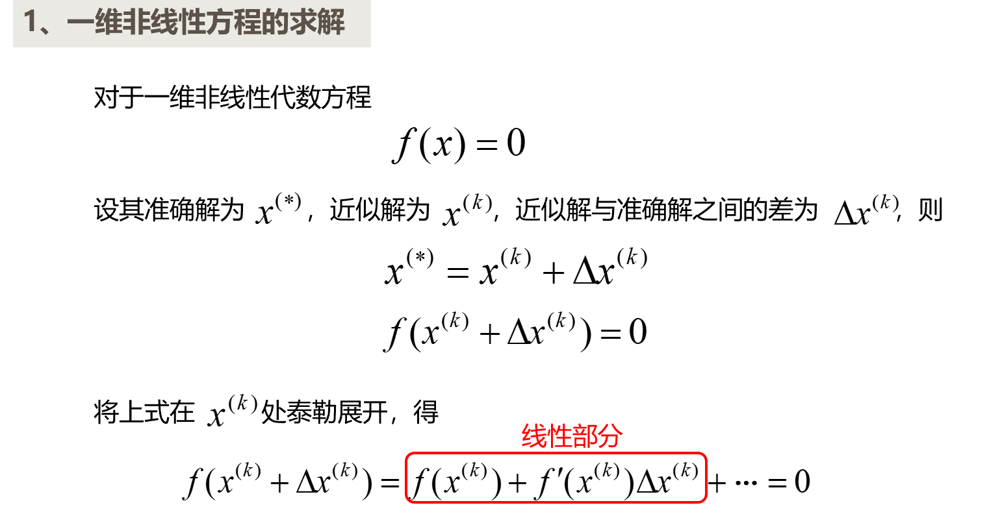
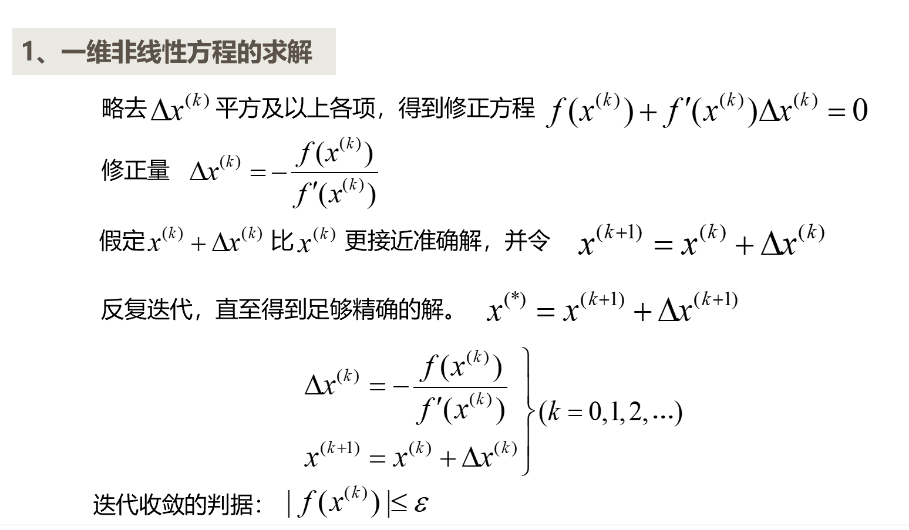
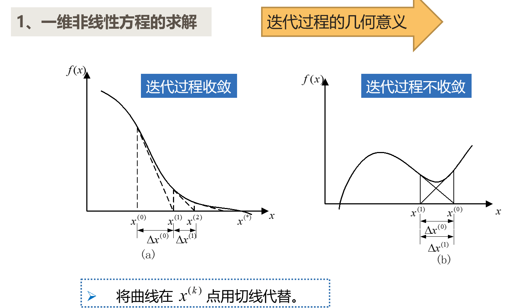

## 2 N维扩展

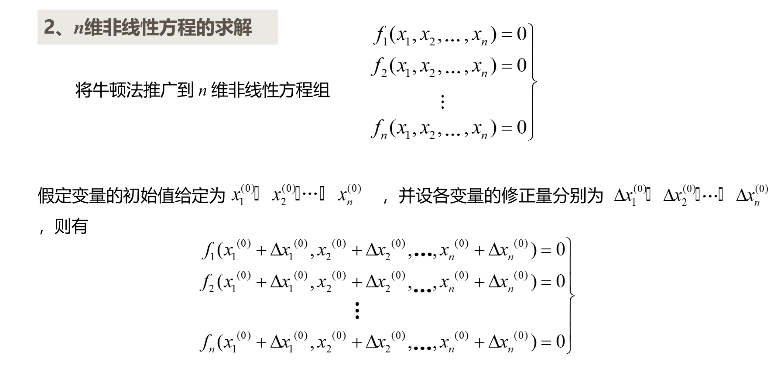
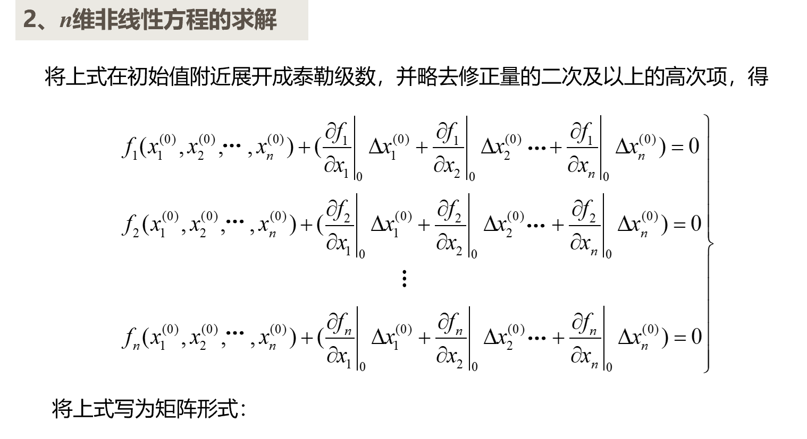
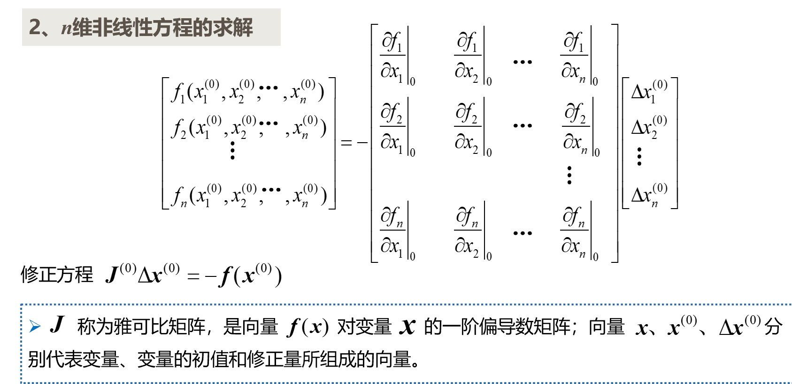
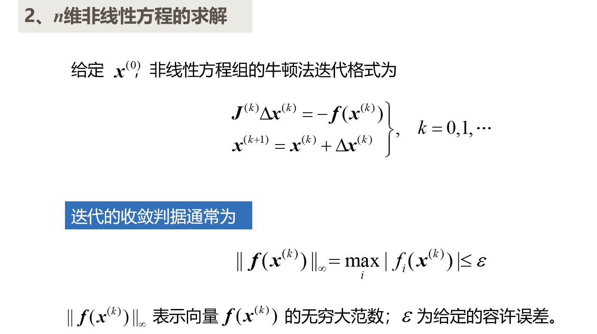

## 3 一般化

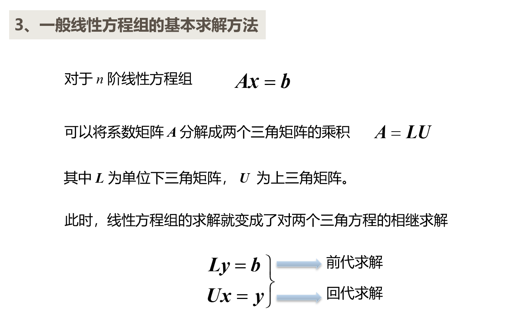

### 3.1 潮流计算

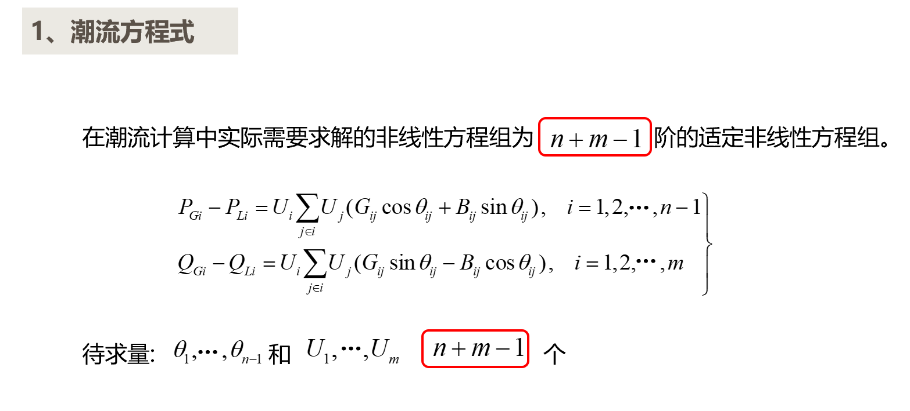
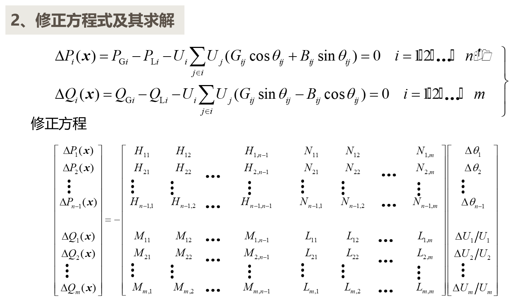
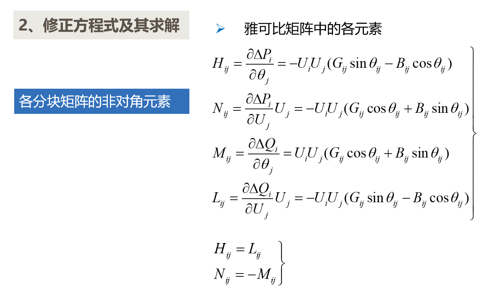
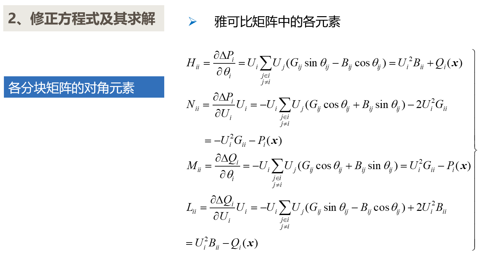

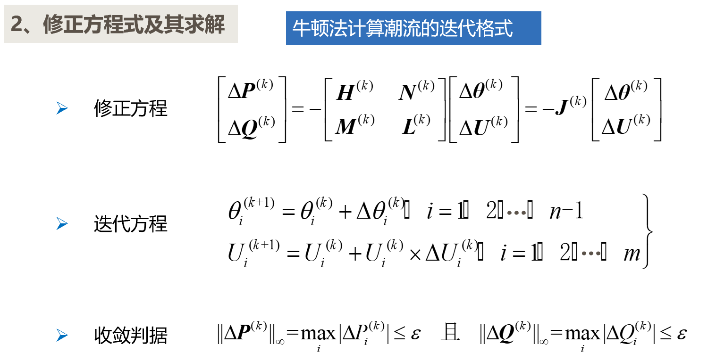

## 4 其他方法

NR法，PQ法，高斯赛德尔法

## 5 对比

| 方法          | 求解时间 | 求解速度 | 迭代次数             | 迭代时间             |
| ------------- | -------- | -------- | -------------------- | -------------------- |
| 牛顿-拉夫逊法 | 中       | 中       | 通常较少             | 每次迭代时间相对较高 |
| PQ分解法      | 少       | 慢       | 不适用（非迭代方法） | 不适用（非迭代方法） |
| 高斯-赛德尔法 | 多       | 快       | 可能较多             | 每次迭代时间相对简单 |

**Newton-Raphson法对初始值的要求高**

**Newton-raphson法的方程维度**
| 类型     | 有功方程个数               | 无功方程个数 | 电压方程个数 | 总方程个数   | PQ  | PV               |
| -------- | -------------------------- | ------------ | ------------ | ------------ | --- | ---------------- |
| 极坐标   | \(m + n - m - 1 = n - 1 \) | \( m \)      | 无           | \( n + m \)  | 2m  | \(n - m - 1\)    |
| 直角坐标 | \( n - 1 \)                | \( m \)      | \(n-m-1\)    | \( 2n - 2 \) | 2m  | \(2(n - m - 1)\) |

**电力网络的潮流调控**

