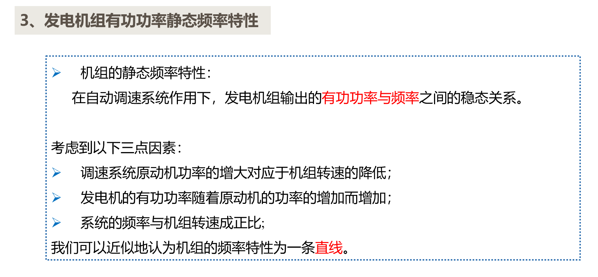
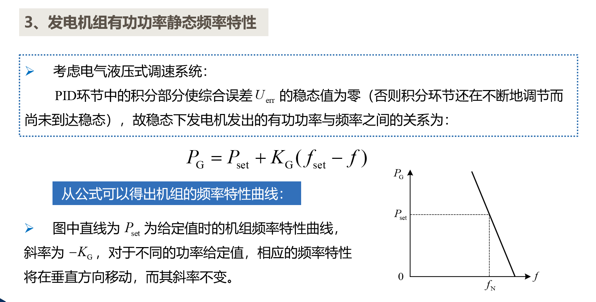
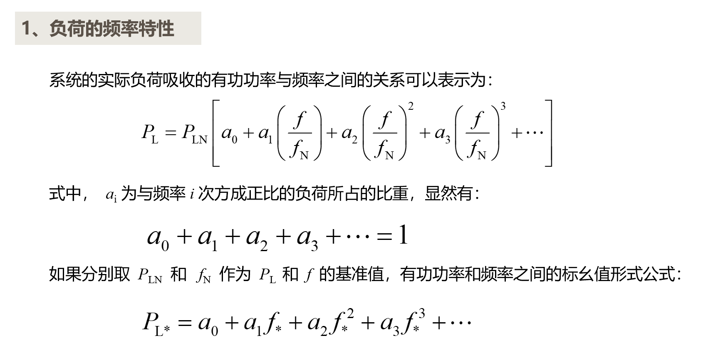
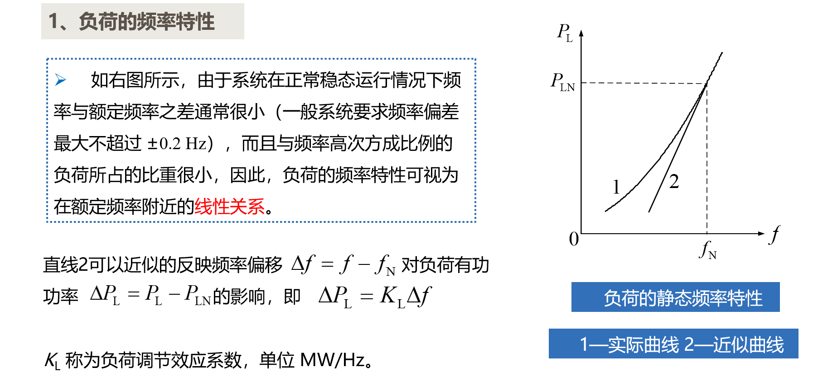
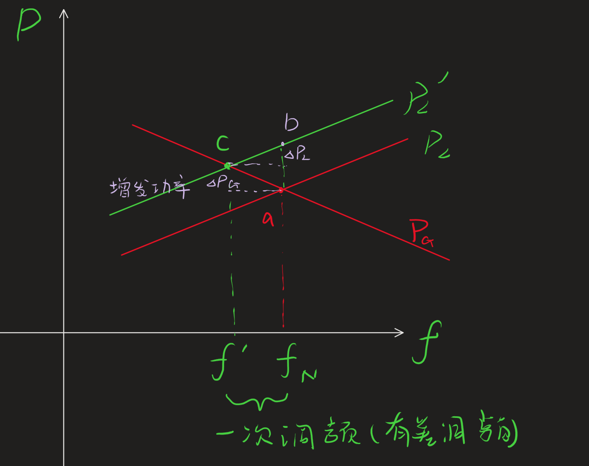
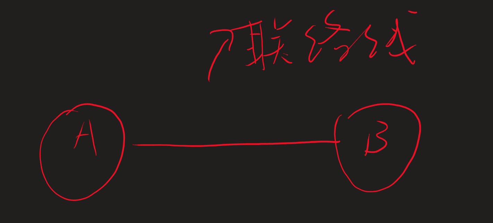
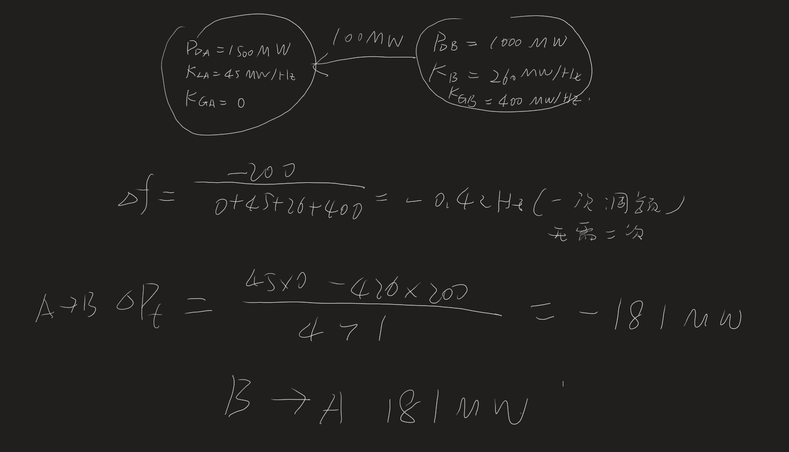

# 电力系统有功功率和频率的调整与控制

## 1 有功平衡方程
- *
  1. P -> f 有功不足，供电小于需求 f会下降(发电机转不动)，要么切负荷，要么增机组
  2. Q -> U

线损主要是输电线和变压器

1. $$\sum_{i=1}^gP_{\mathrm{GN}i}-P_{\mathrm{L}\Sigma\mathrm{~max}}-\Delta P_{\mathrm{max}}-P_{\mathrm{R}}\geq0$$

2. 备用
   1. 负 2% 热备用
   2. 国 3% 冷备用
   3. 检 4% 冷备用
   4. 事故备用 5% 热备用and冷备用

## 2 负荷特点

3. 负荷特点
   1. 随机负荷 -> 一次调频 -> 调速器(所有未满载的) -> 有差调频
   2. 脉动负荷(一次调频无法满足) -> 二次调频 -> 调频器,调频厂 -> 可以实现无差调频
   3. 基础负荷 -> 三次调频(事前预测) -> 优化调频

**发电机组有功功率静态频率特性**

**一般调整发电机(线损，负荷等都不容易调整)**

## 3 调频措施

- **负荷频率特性**：
  $$\Delta P_L = K_L \Delta f$$
  - $K_L$ 负荷调整效应系数
  - 
- **发电机频率特性**:
  $$\Delta P_G = -K_G \times \Delta f$$
  - $K_G$: 发电机单位调节功率
  - $\Delta P_L$:负荷由于f下降被动减少需求。
  - $\Delta P_G$:发电机牺牲动能，转化成电功率。
  - 
  - 发电机牺牲动能转化成电功率，导致频率下降
- **系统的单位调节功率**
  $$K_S = K_L + K_G = -(\Delta P_G - \Delta P_L )/\Delta f$$
- **调差系数百分数**
  $$\sigma \%=  \frac{100}{K_{G*}}$$

**互联电力系统的频率调整**

1. 原则：公区控制，就地平衡
2. 要求：$\Delta f$在允许的范围内，联络线功率不越限
3. 计算：
   $$\Delta f = \frac{(\Delta P_{GA} -\Delta P_{LA})+(\Delta P_{GB} - \Delta P_{LB}) }{K_A + K_B}$$
   - 对于A：$\Delta f_{A} = \frac{\Delta P_{GA} - \Delta P_{LA}-\Delta P_t}{K_A}$
   - 对于B：$\Delta f_{B} = \frac{\Delta P_{GB} - \Delta P_{LB}+\Delta P_t}{K_B}$
   - $$令\Delta f_{A}=\Delta f_{B}$$
      $$\Delta P_{t}=\frac{K_{A}(\Delta P_{LB}-\Delta P_{GB})-K_{B}(\Delta P_{LA}-\Delta P_{GA})}{K_{A}+K_{B}}$$

**例题**

## 4 系统频率的二次调整

- **基础要求**
  - 容量大
  - 速度快
  - 经济效益

- **一般调频选型**
  - 洪水季节
    - 中温中压火电厂(高温高压效率高，用于发电而非调频)
  - 枯水季节
    - 水电厂(洪水季节水电厂要用于发电)