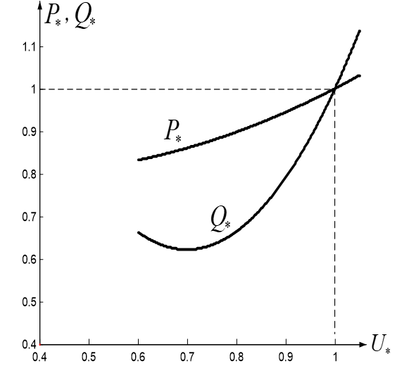
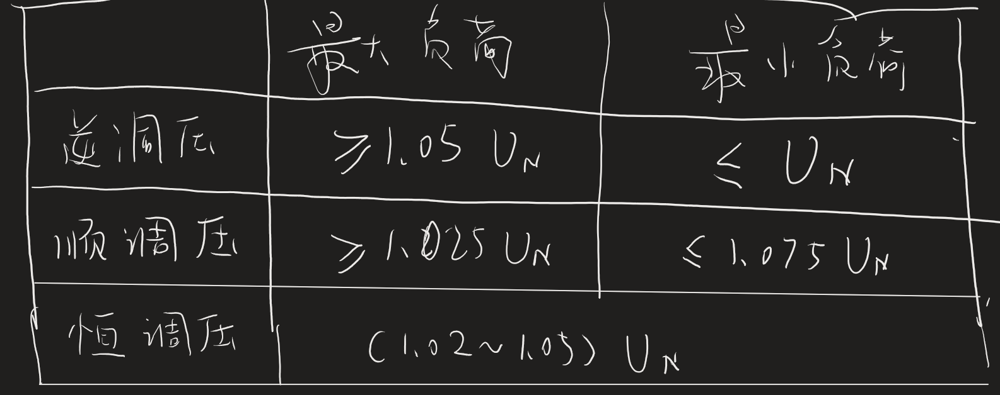

# 电力系统无功功率和电压的调整与控制

1. 为什么调整电压
   1. 低于$U_N$ 负荷效率，电压崩溃
   2. 高于$U_N$ 绝缘受损 寿命
2. 电压如何调整
   1. 无功平衡
      1. 供大于需 U 上升
      2. 供小于需 U 下降
      3. 来源
         1. 电抗器件
            1. 发电机，并电容，并电抗，调相器，静止无功补偿器，静止无功发生器。
      4. 损耗
         1. 负荷，线路，变压器。
   2. 静态电压特性
      1. 负荷
      2. 方程：书(5-10)
      3. 图
   3. 调压措施
      1. 中枢点
         1. 选择:p133
         2. 管理：
      2. X>>R；无功消耗>>有功消耗
         1. 发电机 $\cos \varphi$ 0.85~0.9
         2. $2Q_D$
            1. 负荷$\cos \varphi$0.6~0.9
            2. 线损 25%$Q_D$
            3. 变压器(50%~70%)$Q_D$
      3. 调压措施
         $$U_L = (U_{GK_1}- \frac{PR+QR}{U_N})$$
         1. 调发电机电压
         2. 调变压器变比
         3. 调无功补偿容量
         4. 串电容(调节 X)

|  状态  |     最大点高     |  最小点低  |
| :----: | :--------------: | :--------: |
| 过电压 |    > 1.05 UN     |    < UN    |
| 欠电压 |    > 0.925 UN    | ≤ 1.075 UN |
| 恒电压 | (1.02 ~ 1.05) UN |            |
