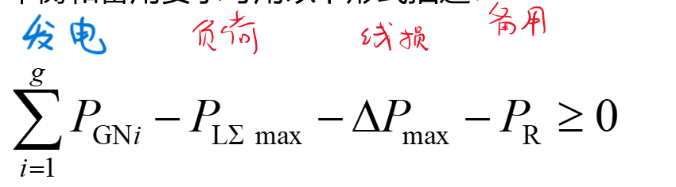

# 电力系统有功功率和频率的调整与控制

1. P -> f 有功不足，供电小于需求 f会下降(发电机转不动)，要么切负荷，要么增机组
2. Q -> U

$$\sum_{i=1}^gP_{\mathrm{GN}i}-P_{\mathrm{L}\Sigma\mathrm{~max}}-\Delta P_{\mathrm{max}}-P_{\mathrm{R}}\geq0$$

2. 备用
   1. 负 2% 热备用
   2. 国 3% 冷备用
   3. 检 4% 冷备用
   4. 事故备用 5% 热备用and冷备用

3. 负荷特点
   1. 随机负荷 -> 一次调频 -> 调速器(所有未满载的) -> 有差调频
   2. 脉动负荷(一次调频无法满足) -> 二次调频 -> 调频器,调频厂 -> 可以实现无差调频
   3. 基础负荷 -> 三次调频(事前预测) -> 优化调频

