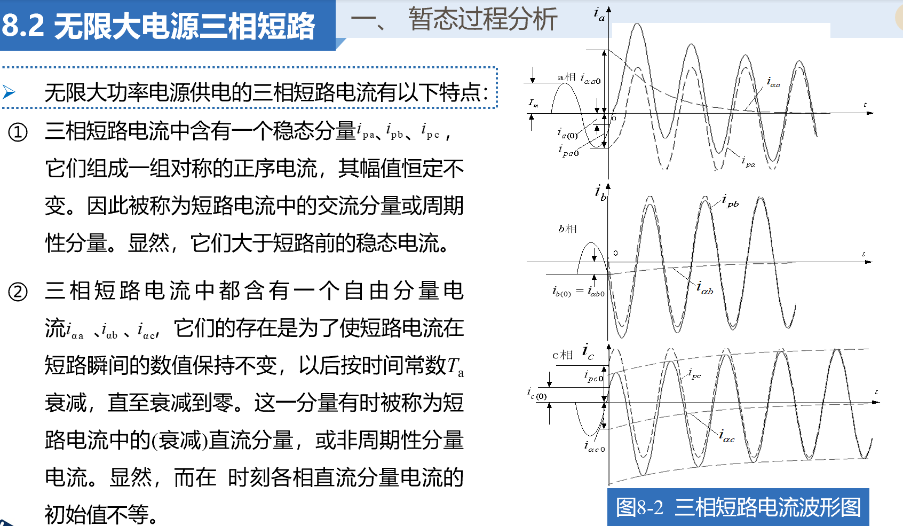
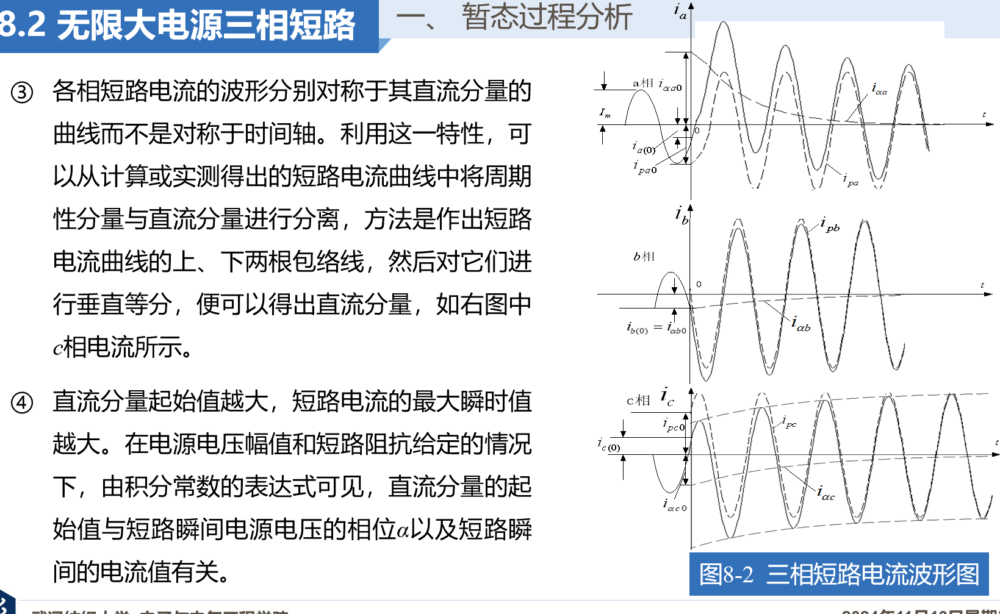
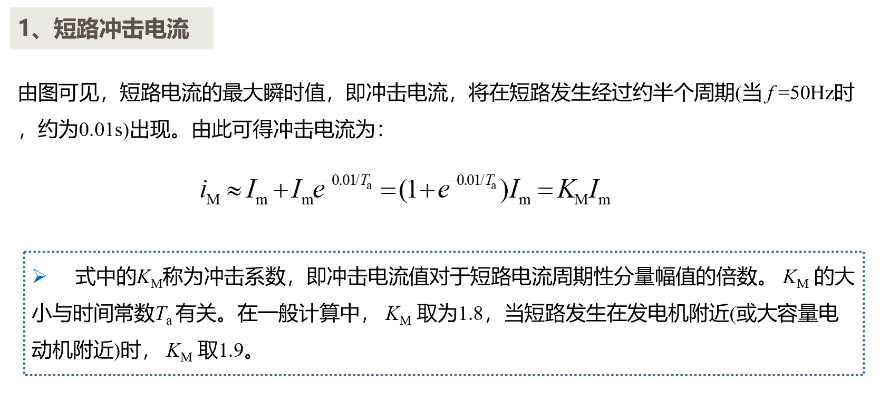
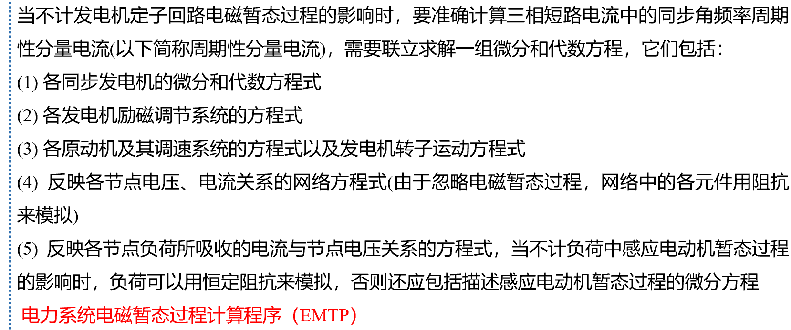
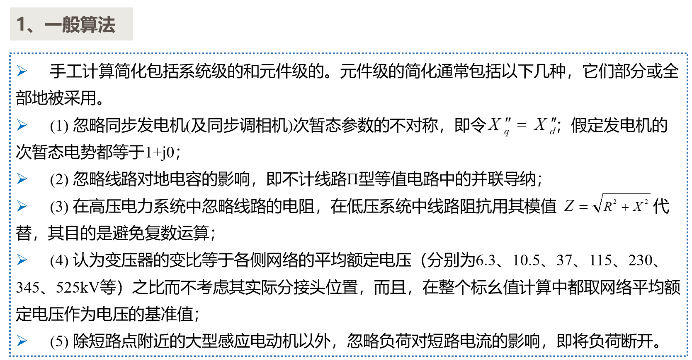
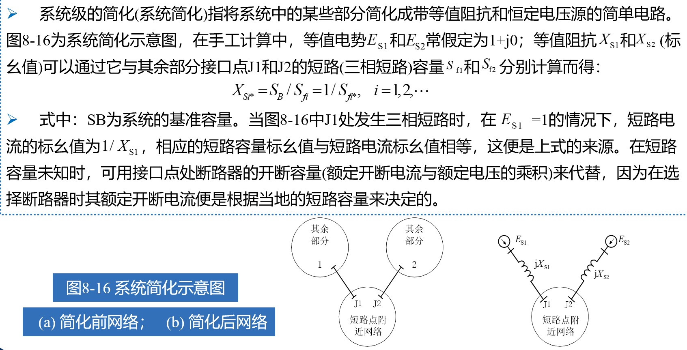

# 电力系统对称故障分析

## 1 故障种类、发生原因及后果

- 短路故障分类
  - 单相短路
  - 两项短路
  - 两相短路接地
  - 三相短路

## 2 无限大电源三相短路

暂态部分会衰减

1. 短路前：$i_a = I_{m_{(0)}}\sin (\omega t + \alpha - \varphi_{(0)})$
2. 短路后：$i_a^* = I_m\sin (\omega t + \alpha - \varphi)$
3. 暂态过程:$i_a = I_m\sin(\omega t + \alpha - \varphi) + e^{\frac{-t}{T_a}}$ 其中T_a为暂态时间常数

### 2.1 短路冲击电流

- `冲击电流`主要用于检测电气设备和载流导体在短路电流下的手里是否超过容许值。
- `短路电流`的最大有效值用于检测开关电气等设备切断短路电流的能力

## 6 短路电流计算法

