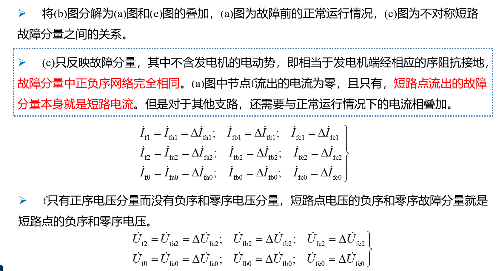
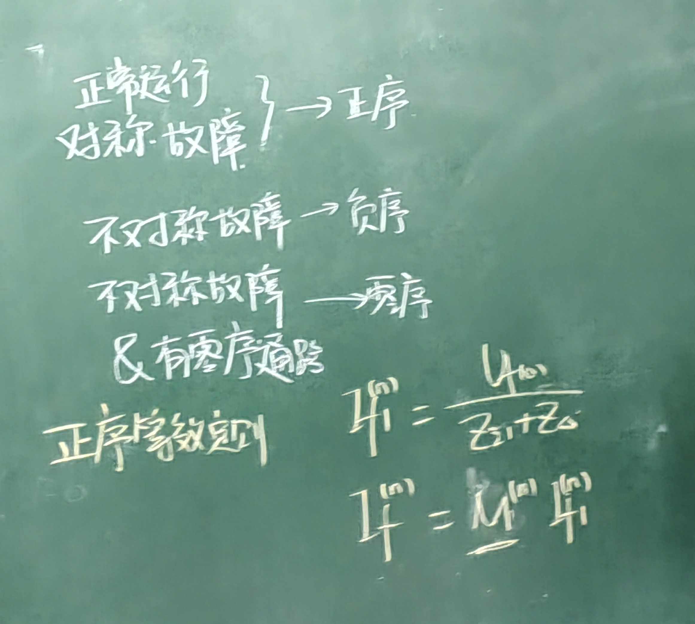

# 电力系统简单不对称故障分析

- [电力系统简单不对称故障分析](#电力系统简单不对称故障分析)
  - [1 对称故障分析](#1-对称故障分析)
  - [2 序阻抗](#2-序阻抗)
    - [2.1 序阻抗](#21-序阻抗)
    - [2.2 变压器](#22-变压器)
    - [2.3 序网络](#23-序网络)
      - [2.3.1 例题](#231-例题)
  - [3 短路点的电流和电压](#3-短路点的电流和电压)
    - [3.1 单相短路故障](#31-单相短路故障)
    - [3.2 两相直接短路](#32-两相直接短路)
    - [3.3 两相接地短路](#33-两相接地短路)
    - [3.4 总结](#34-总结)
    - [3.5 例题](#35-例题)

## 1 对称故障分析

- 概述：
  - 对称故障->只需要分析一相
  - 不对称故障->对称分量法
- 定义：(正序，负序，零序线性叠加)
  

$$
\begin{align}
\vec{F}_a &= \vec{F}_{a1} + \vec{F}_{a2} + \vec{F}_{a0} \\
\vec{F}_b &= \vec{F}_{b1} + \vec{F}_{b2} + \vec{F}_{b0} = a^2 \vec{F}_a + a \vec{F}_{a2} + \vec{F}_{a0} \\
\vec{F}_c &= \vec{F}_{c1} + \vec{F}_{c2} + \vec{F}_{c0} = a \vec{F}_a + a^2 \vec{F}_{a2} + \vec{F}_{a0}
\end{align}
$$

\[
a = e^{j \frac{2}{3} \pi} = \cos\left(\frac{2}{3} \pi\right) + j \sin\left(\frac{2}{3} \pi\right) = 1 ∠ \frac{2}{3} \pi
\]

$$
\begin{align*}
\vec{F}_a &= \vec{F}_{a1} + \vec{F}_{a2} + \vec{F}_{a0} \\
\vec{F}_b &= \vec{F}_{b1} + \vec{F}_{b2} + \vec{F}_{b0} = a^2 \vec{F}_a + a \vec{F}_{a2} + \vec{F}_{a0} \\
\vec{F}_c &= \vec{F}_{c1} + \vec{F}_{c2} + \vec{F}_{c0} = a \vec{F}_a + a^2 \vec{F}_{a2} + \vec{F}_{a0}
\end{align*}
$$

$$\begin{bmatrix}\dot{F}_\mathrm{a}\\\dot{F}_\mathrm{b}\\\dot{F}_\mathrm{c}\end{bmatrix}=\begin{bmatrix}1&1&1\\a^2&a&1\\a&a^2&1\end{bmatrix}\begin{bmatrix}\dot{F}_\mathrm{a1}\\\dot{F}_\mathrm{a2}\\\dot{F}_\mathrm{a0}\end{bmatrix}=\begin{bmatrix}1&1&1\\a^2&a&1\\a&a^2&1\end{bmatrix}\quad\begin{bmatrix}\dot{F}_\mathrm{l}\\\dot{F}_2\\\dot{F}_0\end{bmatrix}$$

**简写为**
$$\dot{F}_{\mathrm{abc}}=T\dot{F}_{120}$$
**对称分量法原理**

**类似基底，基函数的概念，可以唯一确定线性组合，要求基地线性不相关，即正交**

**结论**//core

| 星形接法                 | 三角形接法               |
| ------------------------ | ------------------------ |
|  |  |

## 2 序阻抗

### 2.1 序阻抗

1.  架空线
    1. 单回输电线路
       1. 正序，负序(相互去磁，阻抗小，增加几何均距，阻抗变大)
       2. 零序(相互励磁，阻抗大，增加几何均距离，阻抗变小)
          
    2. 双回输电线路
       1. 正序，负序(由于令一回路$\sum I = 0 $所以零一回路的对这个回路无影响)
       2. 零序(助磁，导致双回路的阻抗大于单回路)
          
    3. 架空地线(避雷线,针对$I_m$)
       1. 正序，负序($I_m = 0$所以不影响)
       2. 零序($I_m$反向去磁，阻抗减小，有架空地线阻抗小于无架空地线，架空地线电阻变小，去磁增强，阻抗变小)
          

### 2.2 变压器

- 励磁导纳
  - 三组式：三相独立，$X_{m_1}=X_{m_2}=X_{m_3}\approx\infty$ 近似堪称线开路
  - 三柱式
    - 正序，负序($X_{m_1} = X_{m_2} \approx \infty$三相磁通 = 0，彼此互为通路)
    - 零序(磁阻 R_m 大，磁导就小，阻抗就小)
- 漏阻抗
  - $X*{1\delta} = X*{2\delta} $
  - $X_{0\delta}$
    - $Y$接法：开路
    - $\Delta$型接法：自成回路
    - $Y_N$与外电路连接：与外电路连接
  - 旋转电机
    - 同步电机
      - 正序$X_d$
      - 负序$\sqrt{X_q^2+X_d^2}$或者$\frac{X_q^2+X_d^2}{2}$
      - 零序$(0.15 \sim0.6)X_d^2$
    - 异步电机
      - 正序 = 负序 = $X_2$
      - 零序$X_0 = \infty$

### 2.3 序网络

- **序网络画法**
  - 正序
    - 只有正序电路有发电机电源
    - 看是否开路
    - $U_{f_1}$
    - 发电机$G$变成$X_1$习惯上加上小括号用于区分发电机在与正序和负序中不相等$X_{(1)}$
  - 负序
    - 看是否开路
    - $U_{f_2}$
    - 发电机$X_2$
  - 零序
    - 从短路往两边看零序通路
    - $U_{f_0}$
    - 发电机$X_0$

#### 2.3.1 例题

## 3 短路点的电流和电压

**将故障分解为正常的部分和故障的部分**

**首先进行序分解，然后使用戴维南等效**

### 3.1 单相短路故障

默认 A 相发生单相短路

**电路分解成正常的部分和故障的部分，故障的部分是对地而言的。所以边界条件是$\dot{U}_{fa}=0;\quad\dot{I}_{fb}=\dot{I}_{fc}=0$**

1. 列出序网络核心方程
2. 给出短路点边界条件
3. 边界条件转化成序网络边界条件
4. 求解方程，得到($I_{f1},I_{f2},I_{f0};U_{f1},U_{f2},U_{f0}$)
5. 得到需要的量

### 3.2 两相直接短路

### 3.3 两相接地短路

### 3.4 总结

$I_f$是故障电流
$I_{f1}$是故障电流的正序分量。

### 3.5 例题

